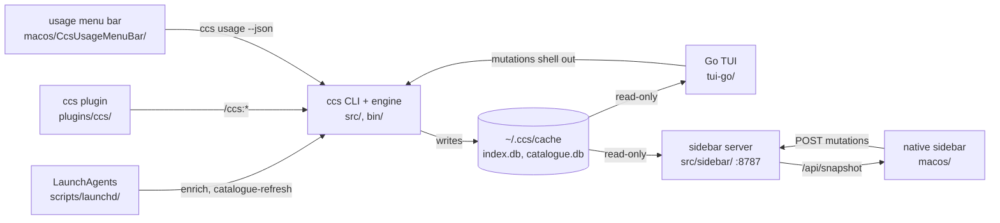

# claude-sessions (`ccs`)

`ccs` is a single-machine session manager for Claude Code. Claude Code's own `--resume`
picker lists only the current directory's sessions; `ccs` indexes every session on the
host, titles them, makes them searchable, and resumes each in its original directory. It
has grown well past that to own managed session birth (who launched what, on which model
and harness, under which causal parent), a catalogue with an Active/Parked/Saved/Done
lifecycle, per-session cost accounting, delegated child sessions, cluster and role
orchestration, and several cmux sidebar surfaces. The consumer is Milad on his own
machines, not a public or multi-tenant product, though the plugin ships through an in-repo
Claude Code marketplace manifest. Much of the agent fleet depends on it: `ccs session new`,
`ccs delegate`, and the `/ccs:*` commands are the sanctioned way agents create sessions.

## Components

Eight, in one repository. The `ccs` CLI is the hub; the others read its caches, front its
sidebar server, or drive it. The September 2026 audit note drew six at an older revision;
the native macOS sidebar and the usage menu-bar app have landed since.

| Component | Path | What it is | Surfaces |
|---|---|---|---|
| `ccs` CLI and engine | `src/`, `bin/`, `package.json` | TypeScript on Bun. The core: indexing, catalogue, cost, delegation, cluster and role orchestration. Sole writer of the SQLite caches. | cli-tui, backend-data |
| Go TUI | `tui-go/` | Bubble Tea TUI, the default `ccs` interface. Reads the caches read-only and shells every mutation back to the CLI. | cli-tui |
| Productivity sidebar server | `src/sidebar/` | HTTP server on loopback `:8787`, a work queue for the cmux Dock. A second TypeScript project. The React web app it bundles is now frozen, kept as a fallback. | api, web |
| CCS native sidebar | `macos/` | SwiftUI cmux ExtensionKit extension, now the primary sidebar front-end. A client of the sidebar server: reads `/api/snapshot`, POSTs mutations. `CcsSidebarApp/` is its host app, `Sources/ccs-sidebar-render/` a headless PNG renderer. | desktop, cli-tui |
| cmux Swift sidebar | `integrations/cmux/` | `ccs.swift`, a compact session navigator interpreted by cmux itself, plus `ccs-web.url` and a guarded installer. | configuration |
| Usage menu-bar app | `macos/CcsUsageMenuBar/` | Native SwiftUI `MenuBarExtra` showing live provider usage from `ccs usage --json`. Its own app, shells out to `ccs`. | desktop |
| `ccs` plugin and marketplace | `plugins/ccs/`, `.claude-plugin/` | Claude Code plugin, thirteen `/ccs:*` commands, distributed via an in-repo marketplace manifest. | configuration |
| Scheduled LaunchAgents | `scripts/launchd/` | Two macOS LaunchAgents (enrich, catalogue-refresh) and three installers. The only unattended component. | resident, configuration, cli-tui |

`docs/` is not a component. It ships 100 ADRs, `CONTEXT.md`, `docs/GLOSSARY.md`, and
`docs/runbook.md`, all documentation and no code. `skills/ccs-upkeep/SKILL.md` is a single
Markdown operating guide with no build, test, or runtime of its own; it belongs to the CLI
rather than standing as its own component.

## How they relate

The CLI is the only writer of the two SQLite caches. The Go TUI and the sidebar server open
them read-only, and every write they need routes back through the CLI, so the TypeScript
side stays the sole owner of schema and migrations. The LaunchAgents, the plugin commands,
and the usage menu-bar app are scheduled, interactive, and polling callers of that same CLI.

The sidebar is one server with several front-ends, not several sidebars. `src/sidebar/`
serves the work queue over loopback; the React web app it bundles is frozen and kept only as
a fallback. `macos/` is the primary front-end now, a SwiftUI extension that reads
`/api/snapshot` and POSTs every mutation back, so the projection, actions, and their tests
stay in one place. `integrations/cmux/sidebars/ccs.swift` is a separate compact navigator
interpreted by cmux itself. Confusing the server for its clients, or the interpreted nav for
the extension, is an easy and expensive mistake.

## What the components share

**Three state homes and two caches.** Definitions live in `~/.ccs-config/` (git-backed);
runtime state in `~/.ccs/`, never committed because it holds routed Slack and PR content;
the session Store at `~/.claude/projects/`, read and never written. The two rebuildable
SQLite caches under `~/.ccs/cache/` (`index.db`, `catalogue.db`) are written only by the CLI
and opened read-only by everything else.

**macOS only, and cmux-bound.** The shell binaries are `#!/bin/zsh`, host resolution shells
out to `scutil`, scheduling is launchd, and the two native front-ends are SwiftPM and Xcode
builds. `ccs` must run from inside a cmux surface, because the cmux socket needs auth and a
detached background shell sees every cmux call fail. cmux is version-coupled at `>= 0.64.0`.

**The inference seam is the shared third-party surface.** `src/inference/` and its Go mirror
select between the `codex` and `claude` CLIs, both schema-forced with no agentic tool
access. It is also the one integration with no recorded fixtures.

## Operating notes that span components

**Two clones exist and the plists pin the other one.** Both LaunchAgents hardcode
`/Users/mimen/Programming/Deployments/claude-sessions/bin/ccs`, so that checkout is the
operational one. As of the September 2026 audit, `~/Programming/Repos/claude-sessions` was
181 commits behind `origin/master` (newest tracked commit 2026-08-12) while the Deployments
clone was current. The repo an agent is pointed at may not be the repo the scheduled jobs
run.

**The scheduled sweeps run anonymous.** Both plists invoke `/opt/homebrew/bin/bun` with
`bin/ccs` as an argument, bypassing the `exec -a` identity that `bin/ccs-launch` applies. So
the longest-lived, least-attended processes in the repo carry no `ccs:*` process name.

**Do not idiomatize `integrations/cmux/sidebars/ccs.swift`.** It deliberately avoids ordinary
Swift nil comparisons, using `if let`, literal row caps, and Boolean-returning predicates, to
route around cmux interpreter bug #7943, where `== nil` and `!= nil` evaluate as unsupported
and rows silently vanish while validation still passes. An agent tidying it into idiomatic
Swift would break it invisibly. This is exactly the trap this file exists to prevent.

## Repo-level gaps

No CI anywhere (confirmed absent at current master), despite 195 TypeScript test files, 24
Go test files, Swift test suites, and `typecheck`, `lint:exports`, and `lint:circular`
scripts that nothing runs on push. No agent entry file: no `AGENTS.md` or `CLAUDE.md` at any
path, despite constant agent traffic and 100 ADRs plus a runbook nothing routes an agent to.
The two LaunchAgents' anonymous process identity, above, is the third gap, and a one-line
plist fix.
